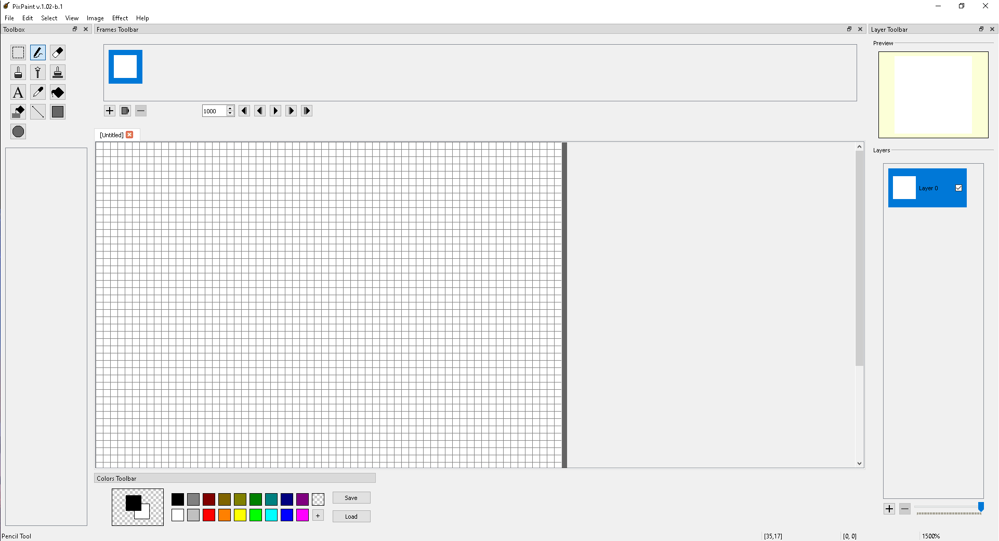
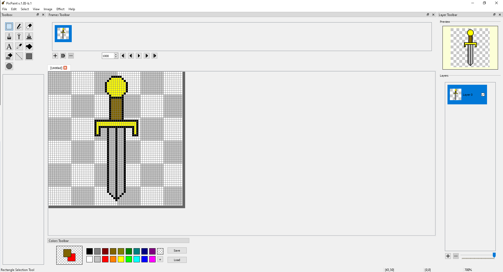

PixPaint
=================
PixPaint is a program to create pixel art, and animated sprites.

Features
=================
1. Image supporting multiple layers
2. Animation supporting multiple frames
3. Tools
	* Brush, Pencil, Eraser, Shape Tools(Square, Circle, Lines)
	* Rectangular selection Tool
	* Text Tool
4. Scriptable tools, and effects
5. Scriptable filetypes
6. Exporting / importing images of BMP, JPEG, PNG and GIF file types
7. Simple and easy to use

Why?
=================
A while back, I was looking around for a pixel art editor and found that most are either too complicated to learn to use or are simple to use but does not have the functionality that I was looking for or are pretty outdated. So, I decided to create PixPaint. I wanted to create a pixel art editor that was both very functional out-of-the-box and simple to learn to use. As a bonus, I made every tool, file type, and effects extensible, so that anyone can add a functionality they want (well, provided they know how to code in python :)).

Screenshots
=================

Limitations
=================
1. Rotation is still a work in progress. There is a way to rotate selections and the whole image itself, but it is very basic. As in, you are given a dialog and you have to type the degrees by which you want to rotate the image / selection basic. In the future, I want to add rotation handles to the selection.

2. The selection interface is always rectangular. Originally, I wanted this to be the case because it goes with the theme of simplicty that I had originally planned for the program. However, after using the the program for some time, I realized how bothersome the selection interface is. Its hard to tell sometimes (specially when using the magic wand tool) which pixels are selected and which are not. Again, I plan to change this in the future, however this will probably require rewritting the way selections are done in the program.
3. No color palettes.

Dependencies
=================
1. Qt5 Framework
2. QMake and make
3. Boost (https://www.boost.org/)
4. clip (https://github.com/dacap/clip)
5. STB image (included in the repository)
6. gif-h (included in the repository)
7. flat_hash_map (included in the repository)
8. C++ compiler that supports c++17 (Tested with gcc and mingw64)
9. Windows / Linux operating system

How to Compile
=================
Run qmake on pixpaint.pro (pixpaint-win.pro for windows)
Run make

Author
=================
Marvin Manese
